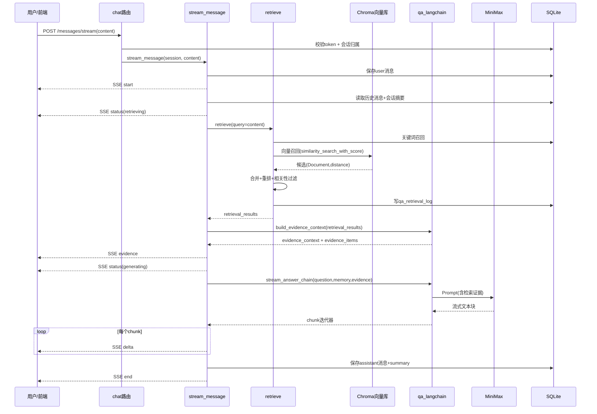

# knowledge_base_backend 智能问答链路说明（纯中文白话版）

## 说明范围
- 目标功能：智能问答
- 入口接口：`POST /api/chat/sessions/{session_id}/messages/stream`
- 本文重点：**用户提问后，系统如何检索知识库，并把检索结果组织后推给 LLM 解释**

---

## 1. 入口文件和核心调用链

## 1.1 入口在哪里
- 路由注册：`app/main.py` 里 `app.include_router(chat.router)`
- 接口定义：`app/routers/chat.py` 的 `post_message_stream`

## 1.2 核心调用链（一句话版）
`post_message_stream`  
-> `stream_message`  
-> `retrieve`（检索）  
-> `build_evidence_context`（把检索结果变成 LLM 可读证据）  
-> `stream_answer_chain`（把证据推给 LLM 流式生成）  
-> SSE 持续返回给前端

---

## 2. 按执行顺序拆解（从接口到回答）

1. 校验登录态、校验会话归属。
2. 先把用户问题落库成一条 `qa_message(role=user)`。
3. 开启 SSE，先发 `start` 事件。
4. 读取最近历史消息 + 会话摘要，拼出记忆上下文。
5. 用当前用户问题直接当检索词（当前版本不做单独 query 改写模型）。
6. 执行 `retrieve`：关键词召回 + 向量召回 + 融合重排 + 相关性过滤。
7. 执行 `build_evidence_context`：产出两份证据  
   - 一份给 LLM 的长文本证据块  
   - 一份给前端展示的结构化证据列表
8. 执行 `stream_answer_chain`：把问题、历史、记忆、证据一起塞进 Prompt，调用 LLM 流式生成。
9. 每来一段 token，就通过 SSE `delta` 往前端推。
10. 生成完成后，保存 assistant 消息与会话摘要，发 SSE `end`。

---

## 3. 三个核心函数的详细执行逻辑

## 3.1 `retrieve`：怎么检索

- 位置：`app/services/retrieval_langchain.py` 的 `retrieve(db, session_id, query, top_k)`

### 输入参数（示例）
- `session_id`: `42`
- `query`: `"集团群组开户怎么操作？"`
- `top_k`: `8`（来自 `QA_RETRIEVE_TOP_K`）
- `db`: 当前请求的数据库会话

### 处理逻辑（参数变化过程）

1. **问题分词**
- 代码：`tokenize(query)`
- 变化示例：
  - 原始：`"集团群组开户怎么操作？"`
  - 可能的 token（示意）：`["集","团","群","组","开","户","怎","么","操","作","集团","团群","群组","组开","开户", ...]`
- 目的：给关键词召回算重叠分。

2. **关键词召回**
- 代码：`_keyword_recall`
- 做法：
  - 从 `kb_chunk` + `kb_document(status=ready)` 全量扫候选。
  - 对每个 chunk 算 `_keyword_score`：关键词覆盖、标题覆盖、词频余弦、短语命中等。
  - 保留前 `top_k * 4`（例如 32 条）作为关键词候选池。
- 候选结构示例：
```json
{
  "chunk": "<Chunk ORM对象>",
  "keyword_score": 0.341,
  "vector_score": 0.0,
  "distance": null,
  "channels": ["keyword"],
  "features": {
    "keyword_overlap_count": 6,
    "title_overlap_count": 2
  },
  "content": "3 集团群组开户..."
}
```

3. **向量召回**
- 代码：`_vector_recall`
- 做法：
  - 调 `query_chunks(query, top_k*3)`，比如取 24 条。
  - 底层走 `vector_store.py -> langchain_runtime.chroma_query -> Chroma.similarity_search_with_score`。
  - 这里没有手写 `embed_query`，是 Chroma 用配置好的 embedding_function 自动把 query 向量化。
- “用户话怎么向量化”：
  - embedding 函数由 `SentenceTransformerEmbeddings` 提供（模型默认 `BAAI/bge-small-zh-v1.5`）。
  - 在查询时，Chroma 会调用这个 embedding 函数把 query 文本变向量，再做近邻检索。
- 变化示例：
  - Chroma 返回 `(Document, distance)`，例如 `distance=0.258`
  - 系统转成 `vector_score = 1 - distance = 0.742`
  - 再用 metadata 里的 `chunk_id` 回数据库确认 chunk 仍然有效。

4. **合并候选**
- 代码：`_merge_candidates`
- 做法：
  - 按 `chunk.id` 去重。
  - 如果同一个 chunk 同时被关键词和向量召回，`channels` 变成 `["keyword","vector"]`。
  - `keyword_score`、`vector_score` 取更高值。

5. **重排打分**
- 代码：`_rerank_candidates`
- 核心公式（代码里的权重）：
  - `final_score = 0.38*keyword + 0.42*vector + multi_channel_bonus + title_hit_bonus + freshness_bonus`
- 解释：
  - 向量分和关键词分都占大头。
  - 双通道命中（关键词+向量）有额外加分。
  - 标题命中有加分。
  - 文档新近更新有小幅加分。

6. **相关性闸门（过滤低质结果）**
- 代码：`_passes_relevance_gate`
- 通过条件（满足其一）：
  - `score >= 0.50`
  - 或 `title_hit = true`
  - 或 `keyword_score >= 0.20 且 vector_score >= 0.55`

7. **截断 + 写检索日志**
- 过滤后取前 `top_k`。
- 把召回快照和最终重排结果写入 `qa_retrieval_log`，然后 `commit`。

### 输出结果（示例）
`retrieve` 最终返回 `list[dict]`，每条大概这样：
```json
[
  {
    "chunk_id": 101,
    "document_id": 8,
    "document_title": "CMIOT-B04-集团群组开户操作指引",
    "content": "3 集团群组开户，路径：进入群组开户页面...",
    "score": 0.8123,
    "keyword_score": 0.341,
    "vector_score": 0.742,
    "distance": 0.258,
    "channels": ["keyword", "vector"],
    "title_hit": true,
    "freshness_bonus": 0.02,
    "chroma_id": "chunk-8-101"
  }
]
```

### 输出传给下一步哪里
- 传给 `build_evidence_context(retrieval_results)`。

---

## 3.2 `build_evidence_context`：怎么把检索结果整理成“喂给 LLM 的材料”

- 位置：`app/services/qa_langchain.py` 的 `build_evidence_context(retrieval_results, max_chars=12000)`

### 输入参数（示例）
- `retrieval_results`: 上一步返回的候选列表
- `max_chars`: `12000`（证据文本总预算）

### 处理逻辑（参数变化过程）

1. **给每条结果生成“证据块文本”**
- 包含字段：`Title/Score/KeywordScore/VectorScore/Channels/Content`
- 目的是让 LLM 读懂“这是哪篇文档、可靠度怎样、具体内容是什么”。

2. **同步构造结构化 evidence 列表**
- 每条保留：
  - `evidence_id`
  - `chunk_id/document_id/document_title`
  - `snippet`（截断）
  - `score/keyword_score/vector_score/channels`
- 这份给前端和落库引用用。

3. **做总长度预算控制**
- 证据文本累计超过 `max_chars` 就停止追加（首条通常会保留）。
- 避免 Prompt 过长、成本过高、模型超限。

### 输出结果（示例）

1) 给 LLM 的证据字符串 `evidence_context`：
```text
[1]
Title: CMIOT-B04-集团群组开户操作指引
Score: 0.8123
KeywordScore: 0.341
VectorScore: 0.742
Channels: keyword, vector
Content: 3 集团群组开户，路径：进入群组开户页面...
```

2) 给前端/落库的结构化 `evidence_items`：
```json
[
  {
    "evidence_id": 1,
    "chunk_id": 101,
    "document_id": 8,
    "document_title": "CMIOT-B04-集团群组开户操作指引",
    "snippet": "3 集团群组开户，路径：进入群组开户页面...",
    "score": 0.8123,
    "keyword_score": 0.341,
    "vector_score": 0.742,
    "channels": ["keyword", "vector"]
  }
]
```

### 输出传给下一步哪里
- `evidence_context` -> `stream_answer_chain(...)`（喂给 LLM）
- `evidence_items` -> 先通过 SSE `event:evidence` 返回前端，最后也写入 assistant 消息 `references_json`

---

## 3.3 `stream_answer_chain`：怎么把证据推给 LLM 并流式产出

- 位置：`app/services/qa_langchain.py` 的 `stream_answer_chain(...)`

### 输入参数（示例）
```json
{
  "question": "集团群组开户怎么操作？",
  "analysis": {
    "intent": "qa",
    "is_follow_up": false,
    "rewrite_query": "集团群组开户怎么操作？",
    "entities": []
  },
  "memory_summary": "topic: qa\nlast_user_question: ...\nlast_answer_summary: ...",
  "recent_messages": [
    {"role":"user","content":"上一次问题..."},
    {"role":"assistant","content":"上一次回答..."}
  ],
  "evidence_context": "[1]\nTitle: ...\nScore: ...\nContent: ..."
}
```

### 处理逻辑（参数变化过程）

1. **构建 Prompt 模板**
- 代码：`_build_answer_prompt`
- 包含两段：
  - system：约束回答边界（只能基于证据、不足要明说、用 Markdown 结构）
  - human：填入 `question / analysis / memory / history / evidence`

2. **构建可执行链**
- 代码：`build_answer_chain`
- 链路是：
  - `ChatPromptTemplate`
  - `ChatOpenAI`（MiniMax OpenAI 兼容）
  - `StrOutputParser`

3. **调用模型流式生成**
- 代码：`chain.stream({...})`
- 底层模型实例来自 `get_chat_llm`，会读取配置：
  - `OPENAI_BASE_URL`（默认 MiniMax 地址）
  - `OPENAI_API_KEY` / `MINIMAX_API_KEY`
  - `MINIMAX_MODEL_NAME`、`MINIMAX_TEMPERATURE`、`MINIMAX_MAX_OUTPUT_TOKENS`

### 输出结果（示例）
- `stream_answer_chain` 返回一个迭代器，逐段吐文本：
  - chunk1: `"### 结论\n可以按以下步骤完成群组开户..."`
  - chunk2: `"\n### 依据\n1. 文档《CMIOT-B04...》中提到..."`
  - chunk3: `"\n### 注意事项\n..."`

### 输出传给下一步哪里
- `stream_message` 里 `for text in stream_answer_chain(...)`：
  - 每个 `text` 直接 SSE `event:delta` 推给前端。
  - 全部收完后再汇总并落库，最后 SSE `event:end`。

---

## 4. 分支、异常、外部依赖（单独标注）

## 4.1 条件分支
1. 会话不存在或不属于当前用户：直接返回错误，不进流式链路。  
2. 检索相关性太弱：`retrieve` 的闸门会过滤掉低质量候选。  
3. 最终证据仍不足：`_should_fallback_no_answer` 触发兜底回答文案。  

## 4.2 异常处理
1. 模型配置缺失（`MinimaxConfigError`）：走本地兜底回答，不中断会话流程。  
2. 流式生成中报错：
- 若一个有效正文都没产出且证据弱 -> 兜底回答
- 否则抛给外层统一错误处理  
3. 统一异常兜底：`db.rollback()` + `_friendly_stream_error` 映射错误码 + SSE `error`。  

## 4.3 外部依赖
- FastAPI + StreamingResponse（SSE）
- SQLAlchemy + SQLite
- Chroma（向量检索）
- SentenceTransformer（向量模型）
- LangChain（Prompt/Chain）
- MiniMax（通过 OpenAI 兼容接口访问）

---

## 5. 一个“自己调用接口后，系统内部发生什么”的完整思路

## 5.1 你在外部这么调
```bash
curl -N -X POST "http://127.0.0.1:8000/api/chat/sessions/42/messages/stream" \
  -H "Content-Type: application/json" \
  -H "x-session-token: your_token" \
  -d "{\"content\":\"集团群组开户怎么操作？\"}"
```

## 5.2 后端内部怎么走（白话）
1. 收到问题后，先记一条用户消息，确保会话记录完整。  
2. 把这句话拿去做两路检索：  
- 关键词路：看“词是否命中”  
- 向量路：把这句话转成向量，去 Chroma 找语义最像的 chunk  
3. 两路结果合并后重排，去掉不靠谱的内容。  
4. 把剩下的结果打包成“证据文本”，连同历史上下文一起塞到 Prompt 里。  
5. 让 LLM 基于这些证据解释，不允许脱离证据乱答。  
6. 模型每生成一点就通过 SSE 往前端推，用户会看到“边生成边显示”。  
7. 回答结束后，把最终答案、引用证据、摘要写回数据库。  

## 5.3 真正推给 LLM 的核心内容是哪些
- 当前问题：`question`
- 会话压缩记忆：`memory_summary`
- 最近对话：`recent_history`
- 检索证据：`evidence_context`（重点）
- 约束规则：system prompt（只按证据答、证据不足要说明）

---

## 6. 时序图（详细版）



