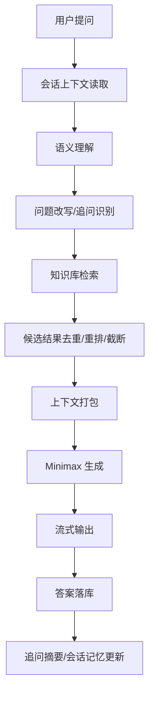

# 智能问答方案（Minimax + 知识库 RAG）

## 1. 目标

本方案用于将当前“检索结果摘要式回答”升级为“**检索增强生成（RAG）+ LLM 统一推理**”的问答系统。

核心目标：

- 用户提问后，先做语义理解和问题改写
- 从知识库召回尽量充分的候选片段
- 将候选片段完整交给 Minimax LLM 做整合、过滤、摘要和最终回答
- 支持流式输出，提升首字响应速度
- 支持后续追加问答，保持多轮上下文连续性

## 2. 设计原则

- **召回优先**：检索阶段宁可多召回，不要过早丢信息
- **模型裁决**：最终答案由 LLM 基于证据统一判断
- **证据可追溯**：每个结论尽量能回指到具体 chunk
- **流式优先**：长答案必须支持边生成边返回
- **多轮连贯**：追问时不把用户当成重新开了一个完全新话题
- **安全约束**：仅允许基于知识库证据回答，禁止编造

## 3. 总体流程



## 4. 分层职责

### 4.1 接口层

职责：

- 接收用户输入
- 鉴权
- 维护会话 ID
- 将请求转入问答服务
- 将流式结果推送给前端

建议接口：

- `POST /api/chat/sessions/{session_id}/messages`
- 或独立流式接口：`POST /api/chat/sessions/{session_id}/messages/stream`

### 4.2 语义理解层

职责：

- 判断用户意图
- 识别是否为追问
- 消解指代词
- 补全上下文
- 形成检索 query

建议输出结构：

```json
{
  "intent": "qa | follow_up | correction | expansion | compare | translate | other",
  "is_follow_up": true,
  "rewrite_query": "补全后的独立问题",
  "entities": ["Minimax", "默认直连", "流式输出"],
  "needs_retrieval": true,
  "risk_level": "low | medium | high"
}
```

### 4.3 检索层

职责：

- 基于 query 做混合召回
- 返回尽量充分的 chunk 候选
- 保留来源元数据

建议检索策略：

- 关键词召回
- 向量召回
- 结果合并去重
- 轻量重排
- 保留 topN 候选而不是只保留极少数

### 4.4 上下文打包层

职责：

- 清洗重复片段
- 限制上下文长度
- 给每条证据编号
- 按文档标题、时间、chunk 顺序组织

### 4.5 LLM 生成层

职责：

- 综合多个证据片段
- 过滤噪声
- 摘要归纳
- 生成最终回答
- 在证据不足时明确说明不足

建议使用 Minimax 的 OpenAI 兼容接口进行统一调用。

### 4.6 流式输出层

职责：

- 将模型输出实时推送给前端
- 支持 token 级或增量文本级返回
- 允许前端展示“正在生成”

## 5. 语义理解方案

语义理解建议拆成 4 个子任务：

### 5.1 意图分类

识别用户当前输入属于哪类问题：

- `qa`：标准问答
- `follow_up`：追问
- `correction`：纠错
- `expansion`：补充信息
- `compare`：对比
- `other`：无法归类

### 5.2 追问识别

判断用户是不是在延续上一轮：

- “这个怎么改”
- “那如果换成国内网站呢”
- “你刚才说的第二点是什么意思”

如果是追问，不要直接按新问题独立处理，要合并上一轮答案和证据上下文。

### 5.3 指代消解

把“这个 / 那个 / 它 / 上面那个”补全为具体对象。

例子：

- 用户上一轮问：默认直连怎么配
- 本轮问：那国内站点呢
- 改写后：Clash Verge 中如何仅对国内站点默认直连，其他流量走代理

### 5.4 检索 Query 改写

改写后的 query 应尽量具备：

- 独立性
- 完整性
- 可检索性
- 不依赖聊天历史才能理解

建议模型输出一个标准化 query，再交给检索层。

## 6. 检索方案

### 6.1 召回策略

建议保持混合检索：

- 关键词召回：用于专有名词、标题、字段名、代码名
- 向量召回：用于语义相近、口语化表达、改写提问

### 6.2 候选规模

为了满足“把检索到的信息尽量交给 LLM 处理”，建议：

- 先召回较大 `topK`
- 再做去重和轻量重排
- 最后按上下文预算截断

推荐思路：

- 检索层多召回
- 打包层少浪费
- 生成层只看高质量证据

### 6.3 去重与重排

同一文档同一 chunk 只保留一条。

重排时建议考虑：

- 关键词命中分
- 向量相似度
- 标题命中
- 更新时间
- 是否双通道命中

### 6.4 元数据保留

每条证据建议保留：

- `chunk_id`
- `document_id`
- `document_title`
- `chunk_index`
- `content`
- `score`
- `keyword_score`
- `vector_score`
- `channels`
- `updated_at`

这样 LLM 才能在回答时给出清晰依据。

## 7. 上下文打包方案

打包目标不是“尽可能多塞文本”，而是“在 token 预算内保留最有效证据”。

### 7.1 打包结构

建议统一成下面格式：

```text
问题：
{user_question}

会话摘要：
{conversation_summary}

检索证据：
[1] 标题：...
来源：...
时间：...
内容：...

[2] 标题：...
来源：...
时间：...
内容：...
```

### 7.2 打包规则

- 按相关性排序
- 保留标题和来源
- 每条内容控制长度
- 去掉连续重复片段
- 长文档优先保留最相关部分

### 7.3 证据编号

建议对每个 chunk 编号，后续答案引用时使用编号：

- `1`、`2`、`3`

这样前端可以做“回答 - 证据”联动展示。

## 8. Minimax 生成方案

### 8.1 调用方式

建议采用 OpenAI 兼容接口封装成统一的 `QA Client`。

基础能力：

- 文本生成
- 流式输出
- 多轮消息输入

### 8.2 系统提示词

系统提示词建议强约束：

```text
你是企业知识库问答助手。
你只能基于给定的检索证据回答。
如果证据不足，请明确说明不足，并指出缺少什么信息。
如果证据之间存在冲突，请说明冲突并优先采用更完整、更直接、更近期的证据。
回答要简洁、准确、可追溯。
不要编造知识库之外的信息。
```

### 8.3 输出要求

建议让模型输出结构化内容：

```json
{
  "answer": "最终回答",
  "summary": "简短摘要",
  "evidence_ids": [1, 3],
  "confidence": 0.86,
  "need_followup": false,
  "followup_questions": ["可继续追问什么"]
}
```

### 8.4 生成策略

模型在生成时应该同时完成：

- 证据整合
- 噪声过滤
- 结论归纳
- 简短摘要
- 追问建议

如果问答场景偏业务，可再加一个“输出风格”：

- 先结论
- 再依据
- 再补充说明

## 9. 流式输出方案

### 9.1 为什么要流式

流式输出的好处：

- 降低首字延迟
- 前端体验更自然
- 长答案更稳定
- 便于中途取消

### 9.2 推荐事件格式

如果前端使用 SSE，可定义如下事件：

```text
event: start
data: {"message_id": 123}

event: delta
data: {"content": "正在生成的片段"}

event: evidence
data: {"evidence_ids": [1,2,3]}

event: end
data: {"answer": "...", "summary": "..."}
```

如果前端使用 WebSocket，也可以复用同样的数据结构。

### 9.3 落库时机

建议分两次落库：

- 生成开始时创建 assistant message 占位
- 生成结束后写入最终内容和 references

这样可以支持断线恢复和生成失败重试。

## 10. 追问与多轮问答方案

追问环节不能只看当前问题，要同时看：

- 本轮问题
- 上轮答案
- 上轮证据
- 会话摘要

### 10.1 追问类型

建议把追问分成以下几类：

- **补充型**：再给一个例子
- **指代型**：这个怎么改
- **缩小范围型**：只看国内网站呢
- **纠错型**：你刚才说的不对
- **扩展型**：还有别的方案吗

### 10.2 追问处理流程

1. 读取上一轮用户问题、模型答案、证据
2. 识别当前输入是否依赖历史上下文
3. 必要时重写成独立问题
4. 判断是否需要重新检索
5. 将“历史摘要 + 新证据”一起交给 LLM
6. 生成新的回答
7. 更新会话摘要

### 10.3 是否重新检索

以下情况建议重新检索：

- 用户引入了新约束
- 用户问的是另一个子主题
- 上一轮证据明显不够
- 上一轮答案置信度低

以下情况可以优先复用已有证据：

- 用户只是在要求解释上一轮内容
- 用户只是让你换种说法
- 用户要求提炼摘要

### 10.4 会话摘要

建议维护短摘要字段，用于压缩长对话：

```json
{
  "topic": "智能问答方案",
  "last_user_question": "...",
  "last_assistant_answer": "...",
  "key_entities": ["Minimax", "RAG", "向量库"],
  "open_questions": ["尚未回答清楚的点"]
}
```

## 11. 质量控制

### 11.1 无答案兜底

当检索证据不足时，不要硬答。

推荐策略：

- 明确告诉用户“证据不足”
- 指出缺少哪类信息
- 给出下一步可追问的问题

### 11.2 冲突处理

如果不同 chunk 给出冲突信息：

- 优先更完整的文档
- 优先更近期的版本
- 优先标题命中的来源
- 必要时说明冲突并列出两种说法

### 11.3 结果可解释性

每个答案尽量支持：

- 证据编号
- 来源标题
- 命中片段预览

### 11.4 风险控制

需要避免：

- 编造知识库外内容
- 在证据不足时做确定性结论
- 无限制塞入过长上下文
- 追问时丢失上一轮语义

## 12. 推荐的数据结构

### 12.1 检索结果

```json
{
  "chunk_id": 1,
  "document_id": 10,
  "document_title": "智能问答方案",
  "chunk_index": 3,
  "content": "...",
  "score": 0.92,
  "keyword_score": 0.81,
  "vector_score": 0.89,
  "channels": ["keyword", "vector"]
}
```

### 12.2 语义理解结果

```json
{
  "intent": "follow_up",
  "is_follow_up": true,
  "rewrite_query": "用户对上一轮答案进行追问，询问追问处理方案",
  "needs_retrieval": true,
  "entities": ["追问", "会话上下文", "RAG"]
}
```

### 12.3 LLM 输出

```json
{
  "answer": "...",
  "summary": "...",
  "evidence_ids": [1, 2],
  "confidence": 0.78,
  "need_followup": true,
  "followup_questions": ["是否需要我补一版接口设计？"]
}
```

## 13. 建议的服务拆分

建议拆成以下模块：

- `QuestionAnalyzer`：语义理解、追问识别、query 改写
- `Retriever`：混合召回、重排、过滤
- `ContextPacker`：证据打包、截断、编号
- `LLMAnswerService`：调用 Minimax、流式输出
- `ConversationMemory`：会话摘要、多轮记忆
- `AnswerLogger`：问题、证据、答案、反馈记录

## 14. 与现有系统的衔接

如果基于当前项目演进，建议保持以下现有能力不变：

- 登录鉴权
- 文档上传与切片
- SQLite 元数据存储
- Chroma 向量检索
- 检索日志
- 会话和消息表

需要新增或增强的部分：

- LLM 调用层
- 流式输出接口
- 语义理解层
- 多轮追问处理
- 会话摘要层

## 15. 推荐落地顺序

建议按以下顺序实施：

1. 先把检索结果完整打包给 LLM
2. 再把同步回答改成流式回答
3. 再加入语义理解和追问改写
4. 再加入会话摘要和多轮记忆
5. 最后做效果评估和提示词优化

## 16. 结论

这套方案的核心不是让检索阶段“直接决定答案”，而是：

- 检索负责把材料找全
- LLM 负责理解、过滤、整合和回答
- 流式负责体验
- 会话记忆负责多轮连续性

如果你后续要把它落到当前 FastAPI 项目里，最优先的改造点是：

- 新增 Minimax 调用封装
- 把 `send_message` 改成“检索 + 上下文打包 + LLM 生成”
- 增加流式接口
- 增加追问理解与会话摘要
