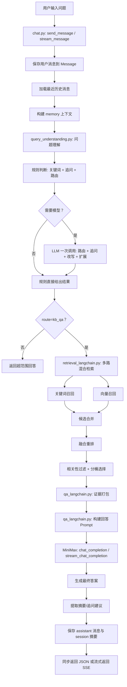
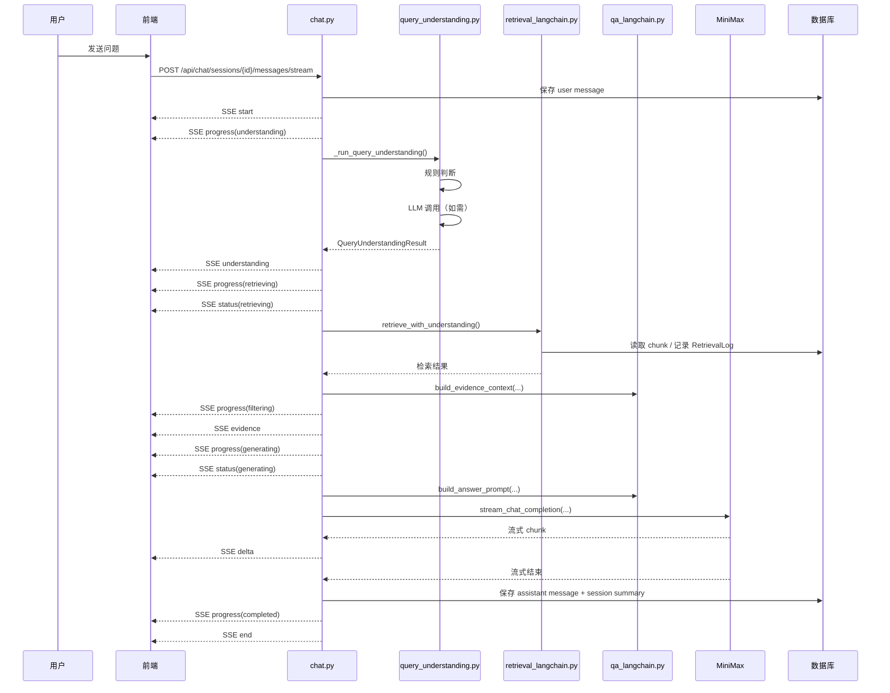

# 智能问答逻辑详解

本文档对应当前代码实现，重点解释以下核心文件：

- `app/services/chat.py`
- `app/services/qa_langchain.py`
- `app/services/query_understanding.py`
- `app/services/retrieval_langchain.py`
- `app/services/minimax.py`

---

## 1. 总体流程图



---

## 2. 流式时序图



---

## 3. 问题理解机制

当前问题理解由 `query_understanding.py` 的 `QueryUnderstandingService.understand()` 实现，采用**规则优先 + LLM 按需补充**的策略。

### 3.1 规则判断（始终执行）

三步规则判断，不调用任何模型：

1. **`detect_keywords()`**：匹配业务关键词表
   - 强关键词（如"物联网集中化支撑系统CMIOT"、"集团成员批量开户"）：命中即高置信
   - 通用关键词（如"开户"、"缴费"、"套餐"）：多个命中可组合判断

2. **`detect_follow_up_by_rules()`**：基于线索词判断追问
   - 短 query（≤18字）+ 追问线索词（"这个"、"那"、"怎么处理"等）
   - 以"那/这/然后/线上"开头

3. **`detect_route_by_rules()`**：综合判断路由
   - 强关键词命中 → kb_qa（confidence=0.96）
   - 多通用关键词命中 → kb_qa（confidence=0.88）
   - 明显超范围线索 → out_of_scope（confidence=0.92）
   - 追问 + 上轮是 kb_qa → kb_qa（confidence=0.78，need_model=true）
   - 都不满足 → out_of_scope（confidence=0.35，need_model=true）

规则层同时生成：
- **`rewrite_query`**：追问时拼接上一轮话题（`_heuristic_rewrite_query()`）
  - 非追问：`rewrite_query = raw_query`
  - 追问：`rewrite_query = "{上一轮问题}；补充追问：{当前问题}"`
- **`search_terms`**：从预定义词表匹配（`_derive_rule_search_terms()`）
- **`search_queries`**：基于规则模板派生（`_derive_rule_search_queries()`）

### 3.2 LLM 调用（按需执行）

当规则判断 `need_model=true` 或需要 enrichment 时，调用 LLM 一次完成 7 项任务：

| # | 任务 | 输出字段 |
|---|------|---------|
| 1 | 路由判断 | `route` |
| 2 | 追问检测 | `is_follow_up` |
| 3 | 上下文依赖 | `need_context` |
| 4 | 改写 query | `rewrite_query` |
| 5 | 关键词抽取 | `keywords_hit` |
| 6 | 实体抽取 | `entities` |
| 7 | 检索扩展 | `search_terms` / `search_queries` |

模型返回 11 字段 JSON：

```json
{
  "route": "kb_qa | out_of_scope",
  "confidence": 0.85,
  "is_follow_up": true,
  "need_context": true,
  "rewrite_query": "物联网卡批量开户流程 修改",
  "keywords_hit": ["批量开户", "修改"],
  "entities": ["物联网卡"],
  "search_terms": ["批量开户", "修改", "主商品"],
  "search_queries": ["批量开户 修改 主商品", "物联网卡 开户 修改流程"],
  "filters": {},
  "reason": "follow_up_to_kb_qa"
}
```

#### LLM 调用条件

| 场景 | 是否调 LLM | 原因 |
|------|-----------|------|
| 强关键词命中，need_model=false，无需 enrichment | 否 | 规则已确定 |
| 明显超范围 | 否 | 规则已确定 |
| 关键词命中但含 enrichment 触发词（"怎么/如何/设置/修改"等，且 query≥8字） | 是 | 需要模型生成更好的检索扩展 |
| 规则不确定，need_model=true | 是 | 需要模型判断路由 |

#### LLM Provider 链路

默认配置：主 provider = Ollama（gemma4:e4b），降级 provider = MiniMax

```
understand_with_fallback()
  ├─ 尝试主 provider (ollama)
  │   └─ understand_with_ollama() → POST /api/generate
  └─ 主 provider 失败时
      └─ 尝试降级 provider (minimax)
          └─ understand_with_minimax() → chat_completion()
```

#### 结果合并与稳定化

LLM 结果与规则结果合并（`_merge_rule_and_model_result()`）：

- **路由**：模型说了算，但强关键词命中时强制 kb_qa
- **置信度**：取规则和模型中更高的
- **追问/上下文**：任一侧为 true 就算 true
- **关键词/实体/检索词**：两边合并去重
- **rewrite_query**：经 `_stabilize_rewrite_query()` 稳定化
  - 追问场景下模型没补上下文 → 回退规则改写
  - 模型改写丢掉了规则命中的关键词 → 回退规则改写

#### 置信度门槛

模型 confidence < `SEMANTIC_CONFIDENCE_THRESHOLD`（默认 0.6）时，丢弃模型结果，回退到规则结果。

### 3.3 已知问题

当前一次 LLM 调用同时完成分类和生成，存在以下问题：

- 4B 小模型对 11 字段 JSON 遵从度不足，经常丢失靠后字段（search_queries / filters / reason）
- 分类和生成任务混合，模型注意力分散
- 约束矛盾（"不要替换术语" vs "生成近义扩展词"），小模型难以平衡
- 输出 token 预算紧张（max_output_tokens=1024），容易截断

代码已通过多层防御缓解：JSON 解析容错、字段降级、置信度门槛、rewrite 稳定化、路由覆写、全链路降级。根本的架构改进方案见《问题理解分层方案设计》。

---

## 4. 代码职责拆分

### 4.1 `app/services/chat.py`

负责"问答编排"和"消息落库"：

- 保存用户消息
- 调用问题理解（`_run_query_understanding()`）
- 调用检索（`retrieve_with_understanding()`）
- 调用回答模型（`invoke_answer_chain()` / `stream_answer_chain()`）
- 处理同步返回和流式返回
- 保存 assistant 消息
- 更新 `ChatSession.summary_json`
- 模型调用失败时降级到本地 `build_answer()`

可以理解为：

`chat.py = 问答主控制器`

---

### 4.2 `app/services/query_understanding.py`

负责"问题理解"：

- 规则判断：关键词匹配、追问检测、路由判断
- LLM 调用：路由 + 追问 + 改写 + 扩展（一次调用完成）
- 规则改写：追问时拼接上下文（`_heuristic_rewrite_query()`）
- 结果合并与稳定化
- Provider 降级链路（Ollama → MiniMax）

可以理解为：

`query_understanding.py = 问题理解引擎（规则 + LLM 补充）`

---

### 4.3 `app/services/qa_langchain.py`

负责"Prompt 组织"和"结果整理"：

- 读取最近历史消息
- 解析会话摘要
- 构建 memory summary
- 打包检索证据
- 构建回答 Prompt
- 从回答里提取摘要
- 从回答里提取追问建议
- 生成 session summary

可以理解为：

`qa_langchain.py = Prompt 工厂 + 文本整理器`

---

### 4.4 `app/services/retrieval_langchain.py`

负责"知识库检索"：

- 对 query 分词
- 走关键词召回
- 走向量召回
- 合并候选
- 做融合重排（含 understanding_bonus）
- 做相关性过滤
- 分桶选择（PRIMARY_SOURCE_QUOTAS + EXPANSION_SOURCE_QUOTAS）
- 支持多路 query specs 检索（`retrieve_with_understanding()`）
- 记录检索日志

可以理解为：

`retrieval_langchain.py = 混合检索引擎`

---

### 4.5 `app/services/minimax.py`

负责"调用模型"：

- 创建 MiniMax OpenAI 兼容客户端
- 执行非流式回答
- 执行流式回答

可以理解为：

`minimax.py = 模型调用适配层`

---

## 5. 当前真实问答链路

### 5.1 同步接口链路

入口：

- `chat.py -> send_message()`

执行步骤：

1. 把用户问题保存到 `Message`
2. 调用 `_prepare_turn_context()`
3. 规则判断（关键词 + 追问 + 路由）
4. 规则不确定或需要 enrichment 时，LLM 一次调用完成路由+改写+扩展
5. 合并规则和 LLM 结果，得到 `QueryUnderstandingResult`
6. route=out_of_scope 时返回超范围回答
7. route=kb_qa 时，用 `rewrite_query` + `raw_query` + `search_queries` + `search_terms` + `keywords_hit` + `entities` 做多路混合检索
8. 把检索结果打包成：
   - 给模型的证据文本
   - 给前端展示的结构化引用
9. 构造回答 Prompt
10. 调用 MiniMax 生成最终答案
11. 提取摘要和追问建议
12. 保存 assistant 消息
13. 更新会话摘要

---

### 5.2 流式接口链路

入口：

- `chat.py -> stream_message()`

与同步链路相比，多了 SSE 分阶段输出：

1. `start`
2. `progress(understanding)`
3. `understanding`（路由、追问、改写结果）
4. `progress(retrieving)`
5. `status(retrieving)`
6. `progress(filtering)`
7. `evidence`
8. `progress(generating)`
9. `status(generating)`
10. 多次 `delta`
11. `progress(completed)`
12. `end`

---

## 6. 检索逻辑说明

当前检索是"多路混合检索"：

### 6.1 关键词召回

使用词法特征：

- query 与正文重叠数
- query 与标题重叠数
- query 与正文余弦相似度
- query 整体短语是否命中正文
- query 整体短语是否命中标题

输出：

- `keyword_score`

### 6.2 向量召回

通过向量库拿到：

- 相似 chunk
- distance

然后换算出：

- `vector_score`

### 6.3 融合重排

最终综合：

- `keyword_score`
- `vector_score`
- `title_hit_bonus`
- `multi_channel_bonus`
- `freshness_bonus`
- `understanding_bonus`（检索扩展词命中加分）

得到：

- `score`

### 6.4 相关性过滤

过滤规则：

- 综合分 ≥ 0.50 → 通过
- 标题命中 → 通过
- 关键词分 ≥ 0.20 且向量分 ≥ 0.55 → 通过
- 纯结构标题 chunk（`is_structure_only`）→ 拒绝

### 6.5 多路检索

`retrieve_with_understanding()` 会把 `rewrite_query`、`raw_query`、`search_queries`、`search_terms`、`keywords_hit`、`entities` 全部作为独立 query 路径，每路独立做关键词+向量混合检索，最后合并重排。

每路检索的候选都会标记 `query_sources`（来源类型）和 `source_ranks`（在该路中的排名），用于分桶选择：

- **主源桶**（PRIMARY_SOURCE_QUOTAS）：raw_query 2 个、rewrite_query 1 个
- **覆盖度选择**：按 coverage_terms 逐词选最佳匹配
- **扩展源桶**（EXPANSION_SOURCE_QUOTAS）：search_query 2 个、search_term 1 个
- **兜底填充**：剩余位置按综合分排序填充

---

## 7. 证据打包的意义

`qa_langchain.py -> build_evidence_context()`

它做了两件事：

1. 给模型生成"证据文本"（带编号、标题、得分、内容）
2. 给前端生成"结构化引用"（chunk_id、document_title、snippet、score 等）

这样可以同时满足：

- 模型回答时有可理解的上下文
- 前端能展示引用来源
- 消息表里能保存 references_json

---

## 8. 会话记忆机制

每轮回答结束后，都会生成：

- `topic`
- `last_user_question`
- `last_answer_summary`
- `key_entities`
- `rewrite_query`
- `retrieved_count`
- `confidence`
- `last_route`
- `query_understanding`

并保存到：

- `ChatSession.summary_json`

下一轮问答时：

- 优先读取这份压缩摘要
- 再补充最近几轮原始消息

这样能避免对话历史无限膨胀。

---

## 9. 模型调用次数

用户原问题输入后，模型调用次数取决于问题理解的结果：

| 场景 | 问题理解 LLM | 生成答案 | 总计 |
|------|-------------|---------|------|
| 功能关闭（QUERY_UNDERSTANDING_ENABLED=false） | 0 | 1 | 1 次 |
| 强关键词命中，规则确定 | 0 | 1 | 1 次 |
| 关键词命中但需 enrichment | 1 | 1 | 2 次 |
| 规则不确定，需模型判断 | 1（+降级时最多再 1） | 1 | 2~3 次 |
| 问题被判定为 out_of_scope | 0~2 | 0 | 0~2 次 |

---

## 10. 关键取舍

### 10.1 改写 query 的策略

当前采用"规则改写 + LLM 改写"混合策略：

- **规则改写**：追问时拼接上一轮话题，始终生效
- **LLM 改写**：生成 rewrite_query / search_terms / search_queries，与规则结果合并

LLM 一次调用同时完成分类和改写，存在小模型遵从度不足的问题。改进方案见《问题理解分层方案设计》。

### 10.2 仍保留 `SemanticAnalysis`

原因：

- 回答 Prompt 结构还在使用
- 会话摘要结构还在使用
- 前端 `evidence.analysis` 结构还在使用

当前 `SemanticAnalysis` 由 `_analysis_from_understanding()` 从 `QueryUnderstandingResult` 构造，不再由模型直接生成。

---

## 11. 推荐阅读顺序

建议按这个顺序读代码：

1. `app/services/chat.py`
2. `app/services/query_understanding.py`
3. `app/services/retrieval_langchain.py`
4. `app/services/qa_langchain.py`
5. `app/services/minimax.py`

如果你是第一次看，最建议先抓住这条主线：

`用户问题 → _run_query_understanding() → retrieve_with_understanding() → build_evidence_context() → invoke_answer_chain() / stream_answer_chain() → 保存`

---

## 12. 关键函数速查

### `chat.py`

- `send_message()`
  - 同步问答入口
- `stream_message()`
  - 流式问答入口
- `_prepare_turn_context()`
  - 准备当前轮次上下文（理解 + 检索 + 证据）
- `_run_query_understanding()`
  - 执行问题理解（规则 + LLM）
- `_analysis_from_understanding()`
  - 从 QueryUnderstandingResult 构造 SemanticAnalysis
- `_should_fallback_no_answer()`
  - 判断是否应该返回兜底回答
- `build_answer()`
  - 本地降级回答（模型调用失败时使用）

### `query_understanding.py`

- `QueryUnderstandingService.understand()`
  - 问题理解总入口
- `detect_keywords()`
  - 业务关键词匹配
- `detect_follow_up_by_rules()`
  - 规则追问检测
- `detect_route_by_rules()`
  - 规则路由判断
- `understand_with_fallback()`
  - LLM 调用（含 provider 降级）
- `understand_with_ollama()`
  - Ollama provider 调用
- `understand_with_minimax()`
  - MiniMax provider 调用
- `_heuristic_rewrite_query()`
  - 规则改写（追问拼接）
- `_build_prompt()`
  - 构造 LLM prompt
- `_merge_rule_and_model_result()`
  - 合并规则和 LLM 结果
- `_stabilize_rewrite_query()`
  - rewrite_query 稳定化

### `retrieval_langchain.py`

- `tokenize()`
  - 轻量分词
- `_keyword_recall()`
  - 关键词召回
- `_vector_recall()`
  - 向量召回
- `_merge_candidates()`
  - 合并候选
- `_rerank_candidates()`
  - 重排（含 understanding_bonus）
- `_passes_relevance_gate()`
  - 相关性过滤
- `_select_bucketed_top_results()`
  - 分桶选择
- `retrieve()`
  - 单 query 检索入口
- `retrieve_with_understanding()`
  - 多路检索入口
- `_query_specs_from_understanding()`
  - 从 understanding 拆出多路 query

### `qa_langchain.py`

- `load_history_messages()`
  - 读取最近聊天记录
- `build_memory_summary()`
  - 构建记忆摘要
- `build_evidence_context()`
  - 打包检索证据
- `build_answer_chain()`
  - 构建回答链
- `invoke_answer_chain()`
  - 同步执行回答链
- `stream_answer_chain()`
  - 流式执行回答链
- `extract_answer_summary()`
  - 提取回答摘要
- `extract_followup_questions()`
  - 提取追问建议
- `build_session_summary()`
  - 生成会话摘要

### `minimax.py`

- `get_client()`
  - 获取模型客户端
- `chat_completion()`
  - 非流式调用
- `stream_chat_completion()`
  - 流式调用

---

## 13. 一句话总结

当前智能问答逻辑可以概括为：

**用户原问题经规则判断和 LLM 问题理解（路由+改写+扩展）后，做多路混合检索，检索结果打包为证据，再由 MiniMax 基于证据生成答案，并以同步或 SSE 流式方式返回。**
