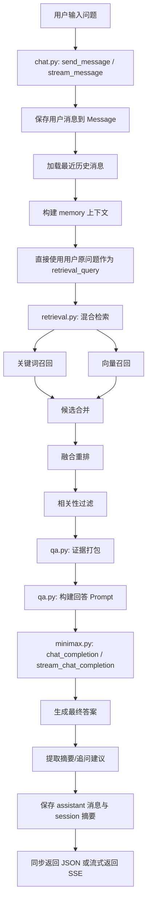
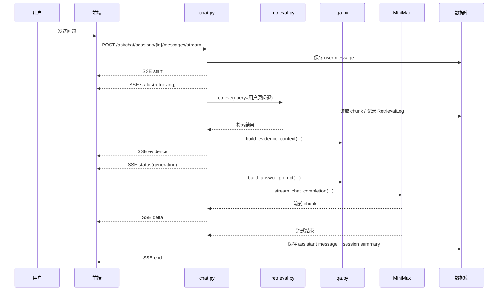

# 智能问答逻辑详解

本文档对应当前代码实现，重点解释以下 4 个核心文件：

- `app/services/chat.py`
- `app/services/qa.py`
- `app/services/retrieval.py`
- `app/services/minimax.py`

当前链路已经去掉“语义理解 LLM 改写 query”这一步，改为：

1. 用户原问题直接检索知识库
2. 检索结果打包成证据
3. 把原问题 + 证据交给 MiniMax 生成答案
4. 结果以流式 SSE 返回给前端

---

## 1. 总体流程图

---

## 2. 流式时序图

---

## 3. 代码职责拆分

### 3.1 `app/services/chat.py`

负责“问答编排”和“消息落库”：

- 保存用户消息
- 调用检索
- 调用回答模型
- 处理同步返回和流式返回
- 保存 assistant 消息
- 更新 `ChatSession.summary_json`

可以理解为：

`chat.py = 问答主控制器`

---

### 3.2 `app/services/qa.py`

负责“Prompt 组织”和“结果整理”：

- 读取最近历史消息
- 解析会话摘要
- 构建 memory summary
- 打包检索证据
- 构建回答 Prompt
- 从回答里提取摘要
- 从回答里提取追问建议
- 生成 session summary

可以理解为：

`qa.py = Prompt 工厂 + 文本整理器`

---

### 3.3 `app/services/retrieval.py`

负责“知识库检索”：

- 对 query 分词
- 走关键词召回
- 走向量召回
- 合并候选
- 做融合重排
- 做相关性过滤
- 记录检索日志

可以理解为：

`retrieval.py = 混合检索引擎`

---

### 3.4 `app/services/minimax.py`

负责“调用模型”：

- 创建 MiniMax OpenAI 兼容客户端
- 执行非流式回答
- 执行流式回答

可以理解为：

`minimax.py = 模型调用适配层`

---

## 4. 当前真实问答链路

### 4.1 同步接口链路

入口：

- `chat.py -> send_message()`

执行步骤：

1. 把用户问题保存到 `Message`
2. 调用 `_answer_with_minimax()`
3. 加载最近历史消息
4. 构建 memory 上下文
5. 直接使用用户原问题作为 `retrieval_query`
6. 调用 `retrieve()` 混合检索
7. 把检索结果打包成：
   - 给模型的证据文本
   - 给前端展示的结构化引用
8. 构造回答 Prompt
9. 调用 MiniMax 生成最终答案
10. 提取摘要和追问建议
11. 保存 assistant 消息
12. 更新会话摘要

---

### 4.2 流式接口链路

入口：

- `chat.py -> stream_message()`

与同步链路相比，多了 SSE 分阶段输出：

1. `start`
2. `status(retrieving)`
3. `evidence`
4. `status(generating)`
5. 多次 `delta`
6. `end`

---

## 5. 检索逻辑说明

当前检索是“混合检索”，即：

### 5.1 关键词召回

使用词法特征：

- query 与正文重叠数
- query 与标题重叠数
- query 与正文余弦相似度
- query 整体短语是否命中正文
- query 整体短语是否命中标题

输出：

- `keyword_score`

### 5.2 向量召回

通过向量库拿到：

- 相似 chunk
- distance

然后换算出：

- `vector_score`

### 5.3 融合重排

最终综合：

- `keyword_score`
- `vector_score`
- `title_hit_bonus`
- `multi_channel_bonus`
- `freshness_bonus`

得到：

- `score`

### 5.4 相关性过滤

如果证据过弱，就不会进入最终回答阶段，避免模型胡编。

---

## 6. 证据打包的意义

`qa.py -> build_evidence_context()`

它做了两件事：

1. 给模型生成“证据文本”
2. 给前端生成“结构化引用”

这样可以同时满足：

- 模型回答时有可理解的上下文
- 前端能展示引用来源
- 消息表里能保存 references_json

---

## 7. 会话记忆机制

每轮回答结束后，都会生成：

- `topic`
- `last_user_question`
- `last_answer_summary`
- `key_entities`
- `rewrite_query`
- `retrieved_count`
- `confidence`

并保存到：

- `ChatSession.summary_json`

下一轮问答时：

- 优先读取这份压缩摘要
- 再补充最近几轮原始消息

这样能避免对话历史无限膨胀。

---

## 8. 当前链路的关键取舍

### 8.1 已去掉语义理解 LLM

原因：

- 会改写用户意图
- 增加一次模型调用耗时
- 对当前场景不是必须

当前改成：

- `retrieval_query = 用户原问题`

### 8.2 仍保留 `SemanticAnalysis`

原因：

- 回答 Prompt 结构还在使用
- 会话摘要结构还在使用
- 前端 `evidence.analysis` 结构还在使用

所以现在是：

- 不再由模型生成 `SemanticAnalysis`
- 而是由 `chat.py -> _build_direct_analysis()` 构造默认值

---

## 9. 推荐阅读顺序

建议按这个顺序读代码：

1. `app/services/chat.py`
2. `app/services/qa.py`
3. `app/services/retrieval.py`
4. `app/services/minimax.py`

如果你是第一次看，最建议先抓住这条主线：

`用户问题 -> retrieve() -> build_evidence_context() -> build_answer_prompt() -> MiniMax -> 保存答案`

---

## 10. 关键函数速查

### `chat.py`

- `send_message()`
  - 同步问答入口
- `stream_message()`
  - 流式问答入口
- `_answer_with_minimax()`
  - 同步主链路实现
- `_build_direct_analysis()`
  - 构造默认语义分析对象
- `_should_fallback_no_answer()`
  - 判断是否应该返回兜底回答

### `qa.py`

- `load_history_messages()`
  - 读取最近聊天记录
- `build_memory_summary()`
  - 构建记忆摘要
- `build_evidence_context()`
  - 打包检索证据
- `build_answer_prompt()`
  - 构造回答 Prompt
- `extract_answer_summary()`
  - 提取回答摘要
- `extract_followup_questions()`
  - 提取追问建议

### `retrieval.py`

- `tokenize()`
  - 轻量分词
- `_keyword_recall()`
  - 关键词召回
- `_vector_recall()`
  - 向量召回
- `_merge_candidates()`
  - 合并候选
- `_rerank_candidates()`
  - 重排
- `_passes_relevance_gate()`
  - 相关性过滤
- `retrieve()`
  - 检索总入口

### `minimax.py`

- `get_client()`
  - 获取模型客户端
- `chat_completion()`
  - 非流式调用
- `stream_chat_completion()`
  - 流式调用

---

## 11. 一句话总结

当前智能问答逻辑可以概括为：

**用户原问题直接检索知识库，检索结果打包为证据，再由 MiniMax 基于证据生成答案，并以同步或 SSE 流式方式返回。**
